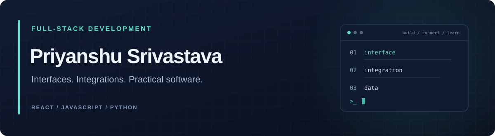

  <a href="https://www.linkedin.com/in/priyanshu-srivastava-a18b27238/">LinkedIn</a> &nbsp; / &nbsp;
  <a href="https://github.com/ShAdOwMoNaRcH29/kanban-react">Featured project</a> &nbsp; / &nbsp;
  <a href="https://github.com/PriyanshuSri2903">Automation workspace</a>

### Hi, I'm Priyanshu.

I'm focused on **full-stack development**, with public work spanning React interfaces, API integration, and Python classification notebooks. I'm interested in building practical applications and understanding how their interfaces, services, and data fit together.

**Interested in full-stack developer opportunities.** [Let's connect on LinkedIn →](https://www.linkedin.com/in/priyanshu-srivastava-a18b27238/)

---

### Selected work

#### 01 / React Kanban Board

A ticket dashboard that fetches tickets and users from an API and organizes work into **five status columns**. Built with React components, JavaScript, and CSS, with loading and error states for the data request.

`React` · `JavaScript` · `REST API integration` · `CSS`

[Try the live demo →](https://shadowmonarch29.github.io/kanban-react/) &nbsp; [Explore the repository →](https://github.com/ShAdOwMoNaRcH29/kanban-react) &nbsp; [View the data flow →](https://github.com/ShAdOwMoNaRcH29/kanban-react/blob/main/src/App.js)

#### 02 / Python Classification Notebooks

Learning projects exploring **support vector machines and logistic regression**, including data preparation, train/test splits, and accuracy evaluation with scikit-learn.

`Python` · `pandas` · `NumPy` · `scikit-learn` · `Jupyter`

[Explore the notebooks →](https://github.com/ShAdOwMoNaRcH29/jubilant-octo-system)

### Technologies in my public work

| Area | Technologies |
| :--- | :--- |
| Interfaces | React, JavaScript, HTML, CSS |
| Data integration | Fetch API, JSON, REST API consumption |
| Python & data | Python, pandas, NumPy, scikit-learn, Jupyter |
| Project workflow | Git, GitHub, npm |

### Beyond the interface

My [secondary GitHub account](https://github.com/PriyanshuSri2903) contains Shuffle and Frappe-related workspaces. It provides a separate home for automation exploration and upstream forks, while this profile brings my portfolio together.

---

  <strong>Have a full-stack opportunity or a project to discuss?</strong> 
  <a href="https://www.linkedin.com/in/priyanshu-srivastava-a18b27238/">Connect with me on LinkedIn</a>

